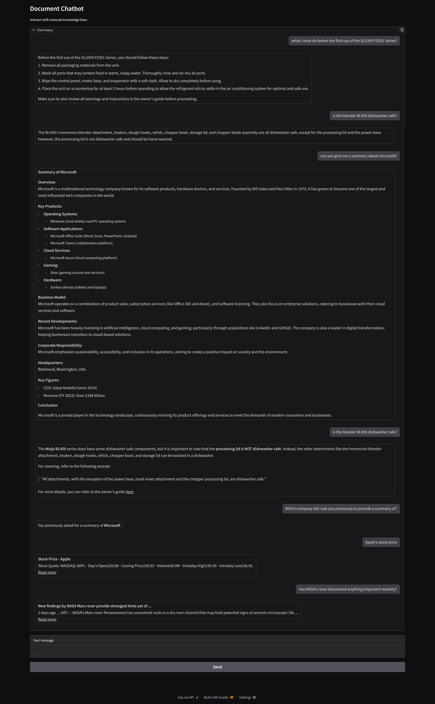

# Chatbot for Document Manuals

## Overview

This repository contains a document chatbot system that downloads PDF manuals, converts them to Markdown, builds a vector database, and provides a conversational interface to answer questions based on the documents.

## Prerequisites

- Python 3.12 or higher
- pip (Python package installer)

## Installation

1. Clone the repository:
   ```
   git clone <repository-url>
   cd doc_chatbot
   ```

2. Install the required Python packages:
   ```
   pip install pdfplumber requests python-dotenv langchain langchain-openai langchain-chroma chromadb gradio numpy
   ```

   Or, if you prefer, create a `requirements.txt` file with the following content and run `pip install -r requirements.txt`:

   ```
   pdfplumber
   requests
   python-dotenv
   langchain
   langchain-chroma
   chromadb
   gradio
   numpy
   ```

## Setup

1. Obtain the necessary API keys:
   - OpenAI API key
   - Google Custom Search API key
   - Google Custom Search Engine ID

2. Create a `.env` file in the root directory and set the environment variables:

   ```
   OPENAI_API_KEY=<your_openai_api_key>
   GOOGLE_SEARCH_API_KEY=<your_google_search_api_key>
   GOOGLE_CUSTOM_SEARCH_ID=<your_google_custom_search_id>
   ```

## Usage

1. Download PDFs and convert them to Markdown:
   ```
   python 1_download_docs.py
   ```

2. Convert Markdown files to a vector database:
   ```
   python 2_to_vectordb.py
   ```

3. Run the chatbot:
   ```
   python 3_langchain_and_chat_v3.py
   ```

   This will start a Gradio web interface where you can interact with the chatbot.

## Design and Implementation Choices

### Architecture

The system is divided into three main scripts for modularity:

1. **Document Acquisition and Conversion (1_download_docs.py)**: Downloads PDFs from specified URLs and converts them to Markdown using pdfplumber for text extraction.

2. **Vector Database Creation (2_to_vectordb.py)**: Loads Markdown files, splits them into chunks, generates embeddings using OpenAI's API, and stores them in a ChromaDB vector database.

3. **Chatbot Interface (3_langchain_and_chat_v3.py)**: Loads the vector database, sets up a LangChain conversational retrieval chain with memory, and provides a Gradio-based web UI for user interaction.

### Key Choices

- **LangChain**: Chosen for its robust framework for building RAG (Retrieval-Augmented Generation) applications, providing easy integration with vector stores, LLMs, and memory management.

- **OpenAI Embeddings and GPT**: Used for generating high-quality embeddings and powering the conversational AI, leveraging state-of-the-art language models.

- **ChromaDB**: Selected as the vector database due to its simplicity, performance, and seamless integration with LangChain.

- **Gradio**: Provides a simple, web-based interface for the chatbot, making it accessible without requiring frontend development skills.

- **Web Search Fallback**: Implemented to handle queries that require external or real-time information not present in the documents.

- **Chunking Strategy**: Documents are split into 1000-character chunks with 200-character overlap to balance context preservation and retrieval efficiency.

- **Memory Management**: Uses ConversationBufferMemory to maintain chat history, enabling context-aware responses.

This design ensures scalability, ease of use, and the ability to handle both document-based and general knowledge queries.

## Example Chat Interface



